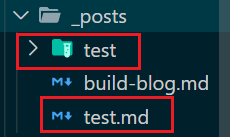

## 准备工作

### 预备知识

- 有一个GitHub账号，没有的话去注册一个；
- 安装了node.js、npm，并了解相关基础知识；
- 安装了git for windows（或者其它git客户端）

### 本文所使用环境

- Windows8.1
- node.js@5.5.0
- git@1.9.2
- hexo@3.2.2

## 搭建GitHub博客

### 安装hexo

先创建一个文件夹blog，然后cd到这个文件夹下（或者在这个文件夹下直接右键git bash打开）。
``` bash
npm install -g hexo-cli
```

接下来初始化一下hexo
``` bash
hexo init myblog
```

这个myblog可以自己取什么名字都行，然后
``` bash
cd myblog //进入这个myblog文件夹
npm install
```

新建完成后，指定文件夹目录下有：

- node_modules: 依赖包
- public：存放生成的页面
- scaffolds：生成文章的一些模板
- source：用来存放你的文章
- themes：主题
- _config.yml: 博客的配置文件

打开hexo的服务：

``` bash
hexo g
hexo server
```
在浏览器输入localhost:4000就可以看到生成的博客了。
使用`ctrl+c`可以把服务关掉。

``` bash
hexo deploy
```
### 将hexo部署到GitHub

#### 新建仓库
新建一个名为你的`用户名.github.io`的仓库

#### 将hexo和GitHub关联起来
也就是将hexo生成的文章部署到GitHub上，打开站点配置文件 _config.yml，翻到最后，修改为：
``` yaml
deploy:
  type: git
  repo: https://github.com/YourgithubName/YourgithubName.github.io.git
  branch: master
```

这个时候需要先安装deploy-git ，也就是部署的命令,这样才能用命令部署到GitHub。
``` bash
npm install hexo-deployer-git --save
```

#### hexo相关命令
``` bash
hexo clean
hexo generate
hexo deploy
```

其中：
- hexo clean清除了你之前生成的东西，也可以不加。
- hexo generate 顾名思义，生成静态文章，可以用 hexo g缩写
- hexo deploy 部署文章，可以用hexo d缩写

然后，可以在http://yourname.github.io 这个网站看到自己的博客了！！

> 有兴趣还可以自己购买域名哦！

## 使用buttfly主题
### 使用butterfly主题（稳定版）配置
#### clone主题
在博客根目录里：
``` bash
git clone -b master https://github.com/jerryc127/hexo-theme-butterfly.git themes/butterfly
```
#### 应用主题
修改站点配置文件`_config.yml`，把主题改为butterfly：
``` yaml
theme: butterfly
```
#### 安装插件
载安装 pug 以及 stylus 的渲染器：
``` bash
npm install hexo-renderer-pug hexo-renderer-stylus --save
```

#### 配置
把主题文件夹中的 `_config.yml` 复製到 Hexo 根目录里，同时重新命名为 `_config.butterfly.yml`。

以后只需要在 `_config.butterfly.yml`进行配置就行。

Hexo会自动合併主题中的`_config.yml`和 `_config.butterfly.yml`里的配置，如果存在同名配置，会使用`_config.butterfly.yml`的配置，其优先度较高。

### 相关魔改
参考：[https://butterfly.js.org]

## 使用Hexo
常用hexo命令：
``` bash
hexo new "postName" #新建文章
hexo new page "pageName" #新建页面(菜单中的跳转页面)
hexo generate #生成静态页面至public目录
hexo server #开启预览访问端口（默认端口4000，'ctrl + c'关闭server）
hexo deploy #部署到GitHub
hexo help  # 查看帮助
hexo version  #查看Hexo的版本
```

部署文件需要三步
``` bash
hexo c
hexo g
hexo d
```
## markdown使用图片
### 安装图片插件hexo-asset-image
``` bash
npm install https://github.com/CodeFalling/hexo-asset-image --save
```
> 由于hexo3版本后对很多插件支持有问题，hexo-asset-image插件在处理data.permalink链接时出现路径错误，因此`npm install hexo-asset-image --save`使用会出现错误
### 修改配置文件
在`_config.yml`配置文件中，修改为 
``` yaml
post_asset_folder: true
```
然后新建一篇文章
``` bash
hexo new post test
```
这个时候会出现一个 `test.md` 和 `test` 文件夹，在文件夹中加入相关照片



然后就可以在文章中引用了

``` md
<!-- 方法一： -->

<!-- 方法二 -->

```

重新编译一下，然后启动服务。

## 添加本地搜索功能
### 安装hexo-generator-searchdb插件
```shell
npm install hexo-generator-searchdb --save
```
### 修改站点配置文件`_config.yml`
```yaml
search:
  path: search.xml
  field: post
  format: html
  limit: 10000
```
### 修改主题配置文件`_config.butterfly.yml`
```yaml
local_search:
  enable: true
```
修改完上述的配置之后，就可以看到网站菜单上面多了一个搜索按钮，点击就可以进行搜索了。
